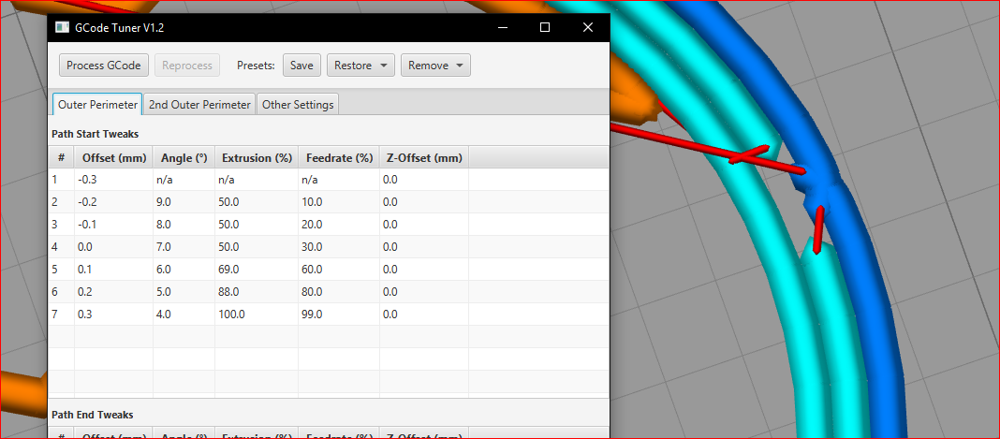

# gcode-tuner

GCode Tuner is a .gcode post-processor. It allows tweaking perimeter start and end segments to help fix small gaps/blobs in prints.

WIP alert, at the moment works best with Simplify 4.0.1 generated gcode and without the shift perimeter option on

